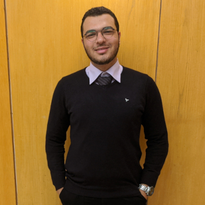

{: style="text-align:center"}

## About Me 

A little bit about myself: My real name is Ahmed Elmayyah(AKA Satharus in some places), I’m a senior computer systems student at Ain Shams University, cybersecurity enthusiast and researcher, and a strong supporter of free/libre software and decentralisation. I currently work as a DFIR Engineer at [Cyber Castle](https://www.cybercastle.io). Sometimes I do purple-teaming too. I am also an [eCRE](https://www.elearnsecurity.com/certification/ecre/).

I was born in Egypt and grew up in the town of Cumbernauld in Scotland. My family moved back to Cairo -where I am currently living- when I was around 10.

My hobbies have mostly been tech-related, such as electronics, cybersecurity, custom PC building and hardware, videogames([add me on Steam](https://steamcommunity.com/id/Satharus/)), and programming. I also enjoy cycling, swimming, writing, research, and progressive rock music.

“Satharus” was the name of my character in a couple of RPG games during high school and it just kinda stuck with me.

### My Work

 
 

I usually like to tinker with low level programming, reverse engineering, Linux, and hardware and stuff. Here's some of the work I am proud of, in no particular order:

- Check out some of my [Bash Snippets](https://github.com/Satharus/Bash-Snippets).
- Full 128-bit [AES Encryption](https://github.com/Satharus/AES-Encryption) written in x86 assembly without using the AES-NI extension. Alongside is the [NASM template](https://github.com/Satharus/NASM-Template) for writing quick assembly programs.
- The not so [chad shell](https://github.com/Satharus/Chell).
- The (forever) WIP GDB interface: [Disass](https://github.com/Satharus/Disass).

Not strictly software, but related:

- [My dot files](https://github.com/Satharus/dotfiles).
- [EOI 2019 Competitive Programming Sessions](https://github.com/Satharus/EOI-Preparation-Sessions) for middle schoolers.
- Open Source Community [FCIS Linux Workshop 2019 content](https://github.com/Satharus/OSC19-Linux-Workshop-Sessions).

### [My GitHub Stats](https://github.com/anuraghazra/github-readme-stats)

 

## Contact Me 
Feel free to contact me anytime! 😀

You can find links to my social media accounts in the site’s footer.

## This site
This site was created using [Jekyll](https://jekyllrb.com/) and the [TeXt theme](https://tianqi.name/jekyll-TeXt-theme/)
